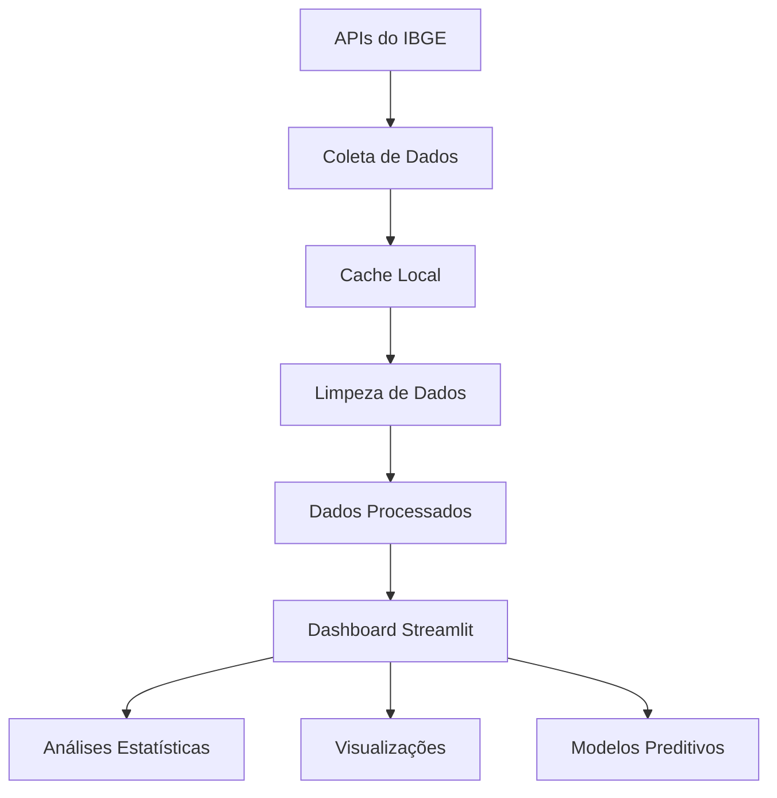

# 📊 Dashboard de Análise de Dados - Documentação Completa

## 🎯 **Visão Geral do Projeto**

Este projeto é um **dashboard completo de análise de dados** desenvolvido em Python, focado na análise de dados populacionais do Brasil. O projeto demonstra todo o pipeline de Data Science, desde a coleta de dados até análises estatísticas avançadas.

### **🏆 Objetivos Alcançados:**
- ✅ Coleta automatizada de dados via APIs do IBGE
- ✅ Processamento e limpeza de dados
- ✅ Análise exploratória (EDA)
- ✅ Dashboard interativo com Streamlit
- ✅ Análises estatísticas avançadas
- ✅ Modelos preditivos de Machine Learning

## 🏗️ **Arquitetura do Sistema**

### **Estrutura de Pastas:**
```
dados-populacao-brasileira/
├── 📁 data/                    # Dados brutos e processados
│   ├── raw/                   # Dados originais da API
│   ├── processed/             # Dados limpos e validados
│   ├── external/              # Dados de fontes externas
│   └── cache/                 # Cache de dados da API
├── 📁 src/                    # Código fonte
│   ├── data/                  # Scripts de coleta e processamento
│   │   ├── collect_ibge_data.py    # Coleta de dados do IBGE
│   │   ├── data_cleaning.py        # Limpeza de dados
│   │   └── api_client.py           # Cliente para APIs
│   ├── analytics/             # Análises estatísticas
│   │   └── statistical_analysis.py # Análises avançadas
│   └── dashboard/             # Aplicação do dashboard
│       └── app.py             # Dashboard principal
├── 📁 notebooks/              # Jupyter notebooks
│   └── 01_analise_exploratoria.ipynb
├── 📁 config/                 # Configurações
├── 📁 tests/                  # Testes unitários
├── 📁 docs/                   # Documentação
└── requirements.txt           # Dependências
```

## 🚀 **Como Executar o Projeto**

### **1. Preparação do Ambiente:**
```bash
# Clonar o repositório
git clone <url-do-repositorio>
cd dados-populacao-brasileira

# Criar ambiente virtual
python -m venv .venv

# Ativar ambiente virtual (Windows)
.venv\Scripts\activate

# Ativar ambiente virtual (Linux/Mac)
source .venv/bin/activate

# Instalar dependências
pip install -r requirements.txt
```

### **2. Executar o Dashboard:**
```bash
# Executar o dashboard principal
streamlit run src/dashboard/app.py
```

### **3. Executar Análises:**
```bash
# Coletar dados
python src/data/collect_ibge_data.py

# Limpar dados
python src/data/data_cleaning.py

# Executar notebook de EDA
jupyter notebook notebooks/01_analise_exploratoria.ipynb
```

## 📊 **Funcionalidades do Dashboard**

### **🎛️ Filtros Disponíveis:**
- **Região:** Norte, Nordeste, Sudeste, Sul, Centro-Oeste
- **Ano:** 2020 a 2025
- **Estado:** Todos os 27 estados brasileiros

### **📈 Visualizações:**
- **Gráfico de Barras:** Top 10 estados mais populosos
- **Gráfico de Pizza:** Distribuição por região
- **Evolução Temporal:** População por ano
- **Tabela Interativa:** Dados detalhados por estado

### **🔬 Análises Estatísticas:**
- **Estatísticas Descritivas:** Média, mediana, desvio padrão
- **Testes de Normalidade:** Shapiro-Wilk
- **Análise de Variância:** ANOVA entre anos
- **Detecção de Outliers:** Métodos IQR e Z-score
- **Modelos Preditivos:** Regressão Linear e Random Forest

## 🔧 **Módulos Principais**

### **1. Coleta de Dados (`src/data/collect_ibge_data.py`)**
- **Função:** Coleta dados populacionais do IBGE
- **APIs Utilizadas:** 
  - `servicodados.ibge.gov.br/api/v1/localidades/estados`
  - `servicodados.ibge.gov.br/api/v3/agregados`
- **Recursos:** Retry automático, fallback para dados estáticos

### **2. Limpeza de Dados (`src/data/data_cleaning.py`)**
- **Função:** Limpa e valida dados coletados
- **Processos:**
  - Remoção de duplicatas
  - Tratamento de valores nulos
  - Validação de população (valores negativos, outliers)
  - Padronização de nomes de estados

### **3. Cliente API (`src/data/api_client.py`)**
- **Função:** Gerencia interações com APIs externas
- **Recursos:**
  - Cache local de dados
  - Fallback automático
  - Tratamento de erros robusto

### **4. Análises Estatísticas (`src/analytics/statistical_analysis.py`)**
- **Classe:** `PopulationAnalyzer`
- **Métodos:**
  - `basic_statistics()`: Estatísticas descritivas
  - `distribution_analysis()`: Teste de normalidade
  - `regional_analysis()`: ANOVA entre anos
  - `correlation_analysis()`: Correlações
  - `outlier_detection()`: Detecção de outliers
  - `predictive_modeling()`: Modelos ML

### **5. Dashboard (`src/dashboard/app.py`)**
- **Framework:** Streamlit
- **Funcionalidades:**
  - Interface interativa
  - Filtros dinâmicos
  - Visualizações responsivas
  - Integração com análises estatísticas

## 📈 **Fluxo de Dados**



## 🛠️ **Tecnologias Utilizadas**

### **📊 Análise de Dados:**
- **Pandas:** Manipulação de dados tabulares
- **NumPy:** Computação numérica
- **SciPy:** Funções científicas e estatísticas

### **📈 Visualização:**
- **Matplotlib:** Gráficos estáticos
- **Seaborn:** Gráficos estatísticos
- **Plotly:** Gráficos interativos

### **🌐 Web e APIs:**
- **Streamlit:** Dashboard web
- **Requests:** Requisições HTTP
- **BeautifulSoup4:** Parsing HTML

### **🤖 Machine Learning:**
- **Scikit-learn:** Algoritmos de ML
- **Statsmodels:** Modelos estatísticos

### **📓 Desenvolvimento:**
- **Jupyter:** Notebooks interativos
- **Git:** Controle de versão

## 📋 **Dependências Principais**

```txt
pandas>=2.0.0          # Manipulação de dados
numpy>=1.24.0          # Computação numérica
streamlit>=1.28.0      # Dashboard web
plotly>=5.15.0         # Gráficos interativos
scikit-learn>=1.3.0    # Machine Learning
scipy>=1.11.0          # Estatísticas
requests>=2.31.0       # Requisições HTTP
matplotlib>=3.7.0      # Visualizações
seaborn>=0.12.0        # Gráficos estatísticos
jupyter>=1.0.0         # Notebooks
```

## 🔍 **Troubleshooting**

### **Problemas Comuns:**

1. **Erro de Módulo não encontrado:**
   ```bash
   # Solução: Adicionar ao sys.path
   import sys
   sys.path.insert(0, project_root)
   ```

2. **APIs do IBGE indisponíveis:**
   - O sistema usa fallback automático para dados estáticos
   - Verificar conectividade com internet

3. **Erro de caminho no Windows:**
   - Usar `get_data_path()` para resolver caminhos relativos
   - Executar Streamlit do diretório raiz

### **Logs e Debug:**
- Verificar logs no terminal
- Usar `st.write()` para debug no Streamlit
- Verificar arquivos de cache em `data/cache/`

## 📚 **Próximos Passos**

### **Melhorias Sugeridas:**
1. **Mais Fontes de Dados:** APIs econômicas, climáticas
2. **Análises Temporais:** Séries temporais, tendências
3. **Machine Learning Avançado:** Deep Learning, NLP
4. **Deploy:** Cloud deployment (Heroku, AWS)
5. **Testes:** Testes unitários e de integração
6. **CI/CD:** Pipeline de integração contínua

### **Funcionalidades Futuras:**
- Análise de correlações com indicadores econômicos
- Previsões populacionais para próximos anos
- Comparação internacional
- Análise de migração entre estados
- Dashboard mobile responsivo

## 👥 **Contribuição**

### **Como Contribuir:**
1. Fork o repositório
2. Crie uma branch para sua feature
3. Implemente suas mudanças
4. Adicione testes
5. Faça commit e push
6. Abra um Pull Request

### **Padrões de Código:**
- Usar PEP 8 para estilo Python
- Documentar funções e classes
- Adicionar type hints
- Escrever testes unitários

## 📄 **Licença**

Este projeto está sob a licença MIT. Veja o arquivo LICENSE para mais detalhes.

## 📞 **Contato**

Para dúvidas ou sugestões, abra uma issue no repositório.

---

**🎉 Parabéns por completar este projeto de Data Science completo!**
